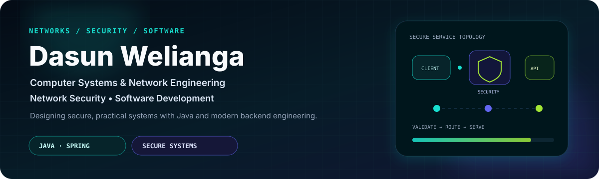
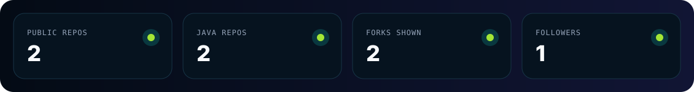
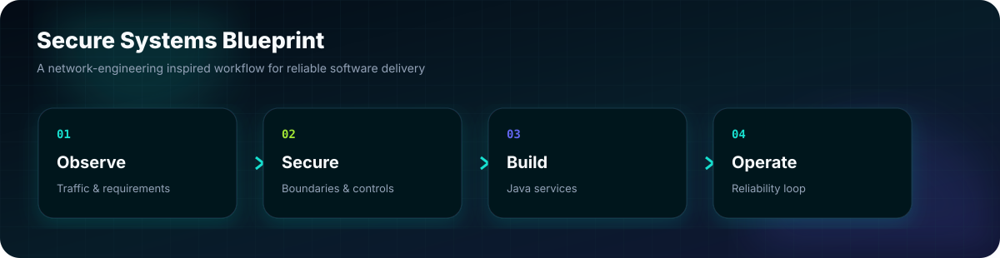
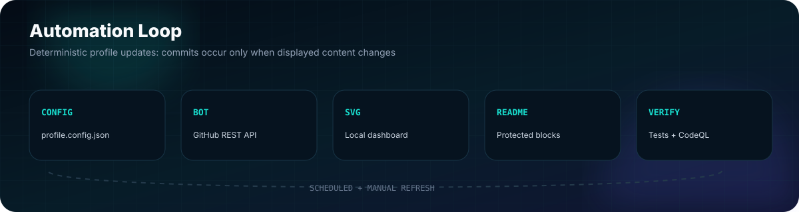

<div align="center">
  

  [](https://github.com/IT24103496/IT24103496/actions/workflows/profile-bot.yml)
  [](https://github.com/IT24103496/IT24103496/actions/workflows/quality-gate.yml)
  [](https://github.com/IT24103496/IT24103496/actions/workflows/codeql.yml)
  [](https://github.com/IT24103496)

  [](https://github.com/DenverCoder1/readme-typing-svg)
</div>

---

<table>
<tr>
<td width="70%" valign="top">

## Hello, I’m Dasun Welianga 👋

I am an undergraduate specializing in **Computer Systems and Network Engineering at SLIIT**, with public interests in **network security** and **software development**. My visible GitHub work currently includes Java application repositories and a Spring Boot-based construction management system project.

```java
record Direction(String degreeFocus, String[] interests, String[] publicSignal) {}

var dasun = new Direction(
    "Computer Systems & Network Engineering",
    new String[]{"Network Security", "Software Development"},
    new String[]{"Java", "Spring Boot", "Automation"}
);
```

</td>
<td width="30%" align="center" valign="middle">
  <a href="https://github.com/IT24103496">
    
  </a>
  <br/><br/>
  <a href="https://www.linkedin.com/in/dasun-welianga">
    
  </a>
</td>
</tr>
</table>

<!-- LIVE_OVERVIEW_START -->
## Live GitHub Pulse



| Signal | Current public data |
|---|---|
| Public repositories displayed | **3** |
| Forked repositories displayed | **2** |
| Followers | **1** |
| Primary repository languages | **Java** |

<sub>Generated from public GitHub API data by <code>profile-bot.yml</code>; commits occur only when displayed data changes.</sub>

<!-- LIVE_OVERVIEW_END -->

---

## Project Spotlight

| Project | Context | Technology signal |
|---|---|---|
| **[builtsmart](https://github.com/IT24103496/builtsmart)** | Publicly visible fork of a construction management system described as built for BuildSmart Lanka Pvt Ltd. | `Java` `Spring Boot` `Web Systems` |
| **[Vehical-Rental-Service](https://github.com/IT24103496/Vehical-Rental-Service)** | Publicly visible vehicle rental service repository. | `Java` `Application Design` |



---

## Technology Canvas

<div align="center">


</div>

<!-- PUBLIC_REPOS_START -->
## Public Repositories

| Repository | Public signal |
|---|---|
| **[builtsmart](https://github.com/IT24103496/builtsmart)**<br/><sub>A comprehensive web-based Construction Management System developed for BuildSmart Lanka Pvt Ltd using Spring Boot and…</sub> | <br/><sub>Forked public repository · updated May 27, 2026</sub> |
| **[Network-Design-for-Behpaya-Information-Technology](https://github.com/IT24103496/Network-Design-for-Behpaya-Information-Technology)**<br/><sub>Technical and Financial Proposal for Behpaya Information Technology. This proposal outlines our approach for the desi…</sub> | <br/><sub>Public repository · updated May 27, 2026</sub> |
| **[Vehical-Rental-Service](https://github.com/IT24103496/Vehical-Rental-Service)**<br/><sub>Public repository.</sub> | <br/><sub>Forked public repository · updated May 21, 2025</sub> |

<!-- PUBLIC_REPOS_END -->

<!-- ACTIVITY_FEED_START -->
## Recent Public Activity

- No recent supported public GitHub activity is visible yet.

<!-- ACTIVITY_FEED_END -->

---

## Automated Profile System



| Feature | Practical logic |
|---|---|
| **Profile Bot** | Reads Dasun’s public GitHub data, ranks visible repositories, updates only protected README sections, and regenerates the local metrics SVG. |
| **Quality Gate** | Runs unit tests, validates configuration and SVG assets, and protects the README marker structure on each change. |
| **CodeQL** | Uses GitHub’s security scanning workflow for the Python automation code. |
| **Contribution Snake** | Generates animated light/dark contribution trails on the `output` branch. |
| **Dependabot** | Proposes weekly GitHub Actions dependency updates. |

### Contribution Trail

<picture>
  <source media="(prefers-color-scheme: dark)" srcset="https://raw.githubusercontent.com/IT24103496/IT24103496/output/github-contribution-grid-snake-dark.svg" />
  <source media="(prefers-color-scheme: light)" srcset="https://raw.githubusercontent.com/IT24103496/IT24103496/output/github-contribution-grid-snake.svg" />
  
</picture>

<sub>The animated trail appears once the **Contribution Snake** workflow is run after publishing.</sub>

---

<div align="center">
  <b>Secure foundations. Reliable systems. Continuous improvement.</b><br/>
  <a href="https://github.com/IT24103496">GitHub Profile</a> · <a href="https://www.linkedin.com/in/dasun-welianga">LinkedIn</a> · <a href="./SETUP.md">Setup Guide</a>
</div>
